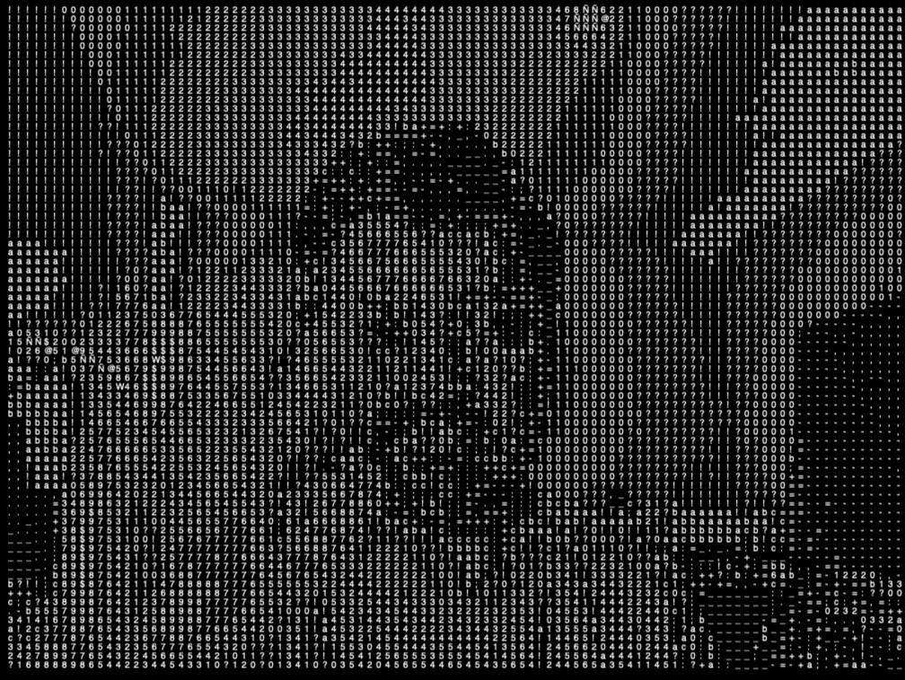
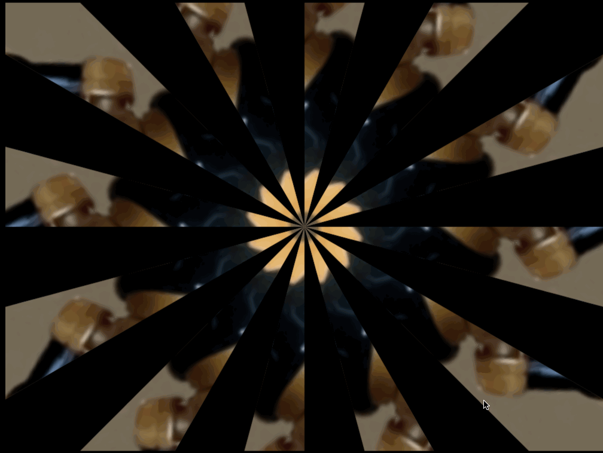
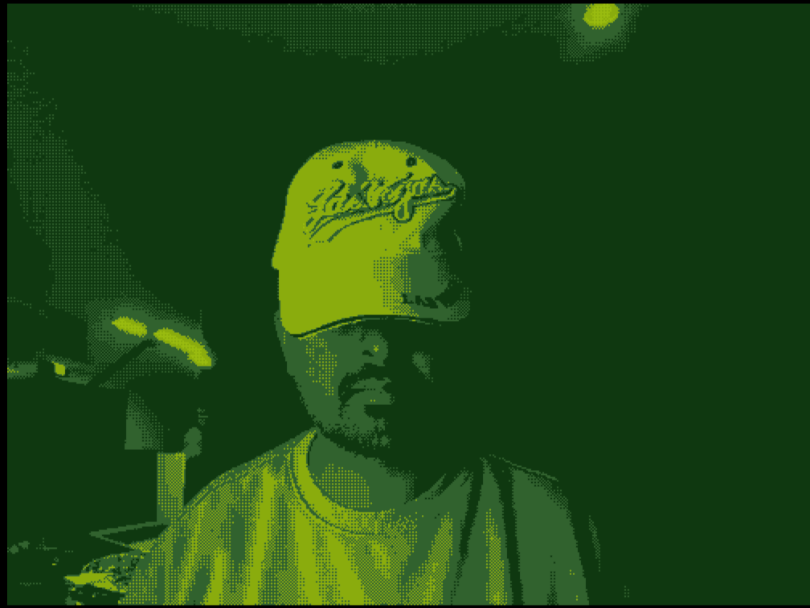
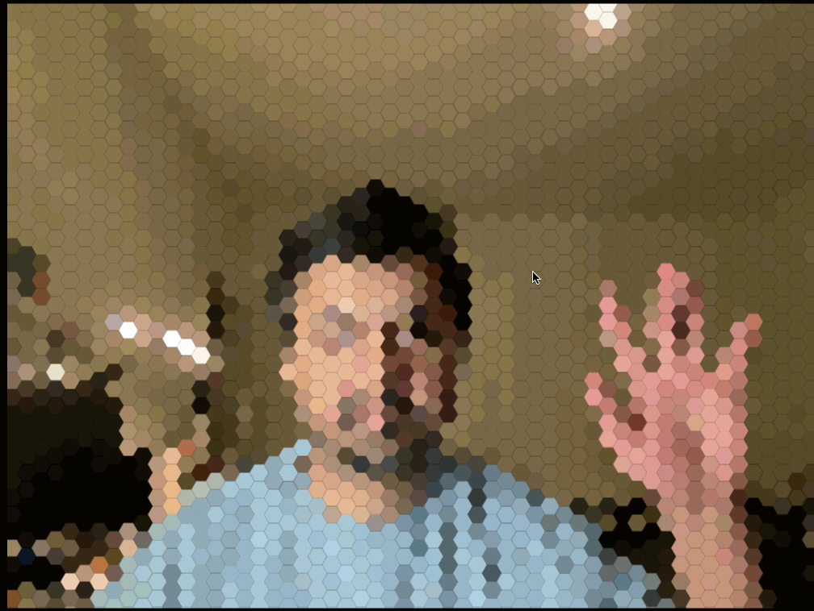

# pixelsynth

A creative coding tool that uses Python to procedurally compile and generate interactive p5.js (JavaScript) sketches for live webcam manipulation.

### Gallery

|----|----|
| <br>**ASCII Matrix** | <br>**Circle halftones** |
| <br>**Bad Cable** | <br>**Kaleidoscope** |
| <br>**Gameboy Camera** | <br>**Hex Mosaic** |
|----|----|

## Description

This project acts as a template engine. It allows you to select an artistic effect from a Python library and outputs a fully functional web directory (HTML + JS) ready to run locally.

**Available Effects:**

### Pixelation & Grid Systems
1. **ASCII Matrix**: Maps pixel brightness to characters.
5. **Standard Pixelate**: Reduces resolution by sampling colors at larger intervals.
6. **Circle Halftone**: Maps pixel brightness to the diameter of black circles on a white grid.
7. **Line Halftone**: Uses varying line thicknesses to represent brightness.
9. **Hexagonal Mosaic**: Samples colors into a honeycomb grid.
10. **Triangle Mesh**: Divides the screen into equilateral triangles filled with average color.
11. **RGB Split Grid**: Displays R, G, and B channels as separate sub-pixels side-by-side.
14. **Quantized Dot Matrix**: Fixed-size dots that turn on/off based on a brightness threshold.
16. **Brick Wall**: Staggered rectangles filled with the average color of that region.
19. **Adaptive Quadtree**: Recursively divides squares into smaller squares only in areas of high contrast.
79. **Triangle Halftone**: Maps pixel brightness to the size of triangles in a grid.

### Color & Light Manipulation
2. **RGB Channel Split**: Offsets red/blue channels based on mouse position.
20. **Solarization**: Inverts pixel values only above a certain brightness threshold.
21. **Posterization**: Reduces the color palette to a few distinct bands.
22. **Heatmap Mapping**: Maps grayscale brightness to a blue-green-red gradient.
23. **Sepia Tone**: Applies a brown-orange tint to a desaturated image.
24. **Duotone**: Maps shadows to one specific color and highlights to another.
25. **Inverted Luma**: Inverts brightness while keeping hue intact.
26. **Threshold**: Converts image to strict black and white based on a cutoff.
28. **Color Isolation**: Turns the image grayscale except for one specific hue.
29. **Luma Keying**: Makes pixels transparent if they are too bright/dark.
30. **False Color**: Swaps RGB channels (e.g., Red becomes Blue).
31. **Contrast Stretch**: Expands the range of brightness values to cover the full spectrum.
32. **Vignette Blur**: Blurs and darkens the edges of the frame while keeping the center sharp.
33. **Neon Glow**: Detects bright areas and adds a blurred bloom effect around them.
34. **CMYK Separation**: Simulates misaligned cyan, magenta, yellow, and black printing plates.

### Geometry & Distortion
4. **Kaleidoscope**: Radial mirror pattern.
13. **Delaunay Triangulation**: Connects random points to form triangles, colored by the centroid.
15. **Concentric Circles**: The image is constructed from concentric rings of varying colors.
35. **Mirror Symmetry**: Splits the screen vertically/horizontally and reflects one side.
36. **Fish-Eye Lens**: Bulges the center of the image outward.
37. **Pinch Distortion**: Sucks pixels toward a specific point (mouse position).
38. **Swirl**: Rotates pixels around the center, with more rotation at the core.
39. **Sine Wave Ripple**: Displaces pixels horizontally based on a sine wave function.
41. **Slit-Scan (Spatial)**: Stretches the center vertical line of pixels to the edges.
44. **Polar Coordinates**: Maps the Cartesian (x,y) image into a circle.
45. **Droste Effect**: Recursively places the video frame inside itself.
47. **Barrel Distortion**: Squeezes the edges of the image inward.
48. **Liquid Displacement**: Uses Perlin noise to warp pixel coordinates smoothly.
101. **Shape Packing**: Packs non-overlapping circles into bright areas.

### Time, Motion & Feedback
3. **Scanline Slit-Scan**: Time displacement effect.
49. **Motion Blur**: Blends the current frame with the previous 5 frames with opacity.
50. **Ghosting / Trails**: Only updates the background slowly, leaving trails of moving objects.
51. **Slit-Scan (Temporal)**: Each column of pixels comes from a different point in time.
52. **Frame Delay Grid**: A grid of videos, each delayed by 1 second more than the last.
53. **Motion Detection**: Subtracts the previous frame from the current one to show only movement.
54. **RGB Delay**: Shows Red channel instantly, Green with 5-frame delay, Blue with 10-frame delay.
55. **Video Feedback**: Draws the previous frame slightly zoomed in and rotated.
56. **Pixel Accumulation**: Pixels "pile up" at the bottom if they are dark (physics simulation).
57. **Freeze Frame Mask**: Freezes parts of the screen that haven't moved in X seconds.
58. **Time Displacement Map**: Uses a grayscale map to determine which "time" (past frame) to sample from.
59. **Optical Flow Particles**: Particles flow in the direction of movement detected in the video.
60. **Frame Averaging**: Averages the last 100 frames to remove moving objects entirely.
61. **Stroboscope**: Only updates the video frame every X milliseconds.
62. **Decay**: Bright pixels fade to black slowly over time.

### Painterly & Stylized
8. **Cross-Hatch**: Layers perpendicular lines; density increases with darkness.
12. **Voronoi Stained Glass**: Cells grow from random seeds, colored by the underlying pixel.
17. **Sine Wave Modulation**: Rows of sine waves where amplitude is driven by pixel brightness.
64. **Pointillism**: Draws random colored circles; density is higher in detailed areas.
65. **Oil Painting**: Scans local neighborhoods and outputs the most frequent color (Kuwahara filter).
66. **Watercolor**: Layers semi-transparent blobs of color with jagged edges.
67. **Impasto**: Uses brightness to simulate thick paint strokes with "height".
68. **Charcoal**: High contrast edge detection with added grain noise.
69. **Mosaic Tiles**: Irregular polygonal shapes with thick mortar lines between them.
70. **Stained Glass (Glow)**: High saturation Voronoi cells with a bloom filter.
71. **Spray Paint**: Random splatter particles appear where the image is darkest.
72. **Cubism**: Overlays multiple perspectives or shifted blocks of the image.
73. **Ink Wash**: Converts to grayscale and simulates ink diffusion/bleeding.
74. **Pastel**: Softens colors and adds a rough paper texture overlay.
75. **Pencil Hatching**: Uses generated flow fields to direct pencil strokes along image contours.
76. **Palette Knife**: Smears pixels horizontally based on brightness.
78. **Paper Cutout**: Quantizes color and adds slight drop shadows to color blobs.
80. **Stipple**: Random dots where density increases with darkness.

### Glitch & Digital Artifacts
18. **Binary Noise**: Random black/white pixels; probability of white is tied to source brightness.
27. **Bit-Crush Color**: Reduces color depth (e.g., 3-bit color) for a retro look.
40. **Pixel Sort**: Sorts pixels in a row/column by brightness.
42. **Broken Glass**: Voronoi cells that displace the image inside them slightly.
43. **Scanline Displacement**: Shifts every other horizontal line left or right.
46. **Tile Scramble**: Breaks image into a grid and randomly swaps tile positions.
81. **JPEG Artifacts**: Intentionally compresses blocks to create blocky noise.
82. **Data Moshing**: Freezes I-frames while moving P-frames (smearing movement).
83. **Scanlines**: Adds horizontal black lines that scroll slowly.
84. **Static Noise**: Adds random colored noise on top of the signal.
85. **Channel Shift**: Randomly offsets R, G, and B channels horizontally.
86. **Vertical Hold**: Simulates the screen rolling vertically.
87. **Block Scramble**: Randomly swaps rectangular chunks of the screen.
88. **Color Banding**: Reduces gradients to harsh bands of color.
89. **Interlace Artifacts**: Draws even lines from current frame, odd lines from previous frame.
90. **Sync Failure**: Bends the top of the image horizontally.
107. **Bad Cable**: Randomly drops the sync signal, causing the image to roll or shear horizontally.

### Edge & Line Detection
77. **Blueprint**: Inverts to blue background with white edge lines.
91. **Sobel Edge Detection**: Highlights areas of high contrast (standard outline).
92. **Canny Edges**: Thinner, cleaner lines than Sobel.
93. **Difference Edges**: Subtracts a blurred version of the image from the sharp one.
94. **Neon Edges**: Edge detection colored by the original pixel hue.
95. **Inverted Outline**: White background, black lines.
96. **Topographic Lines**: Draws contour lines at specific brightness steps.
97. **Flow Field Lines**: Lines follow the "gradient" of pixel brightness.
98. **Wireframe**: Connects grid points if their brightness difference is high.

### Typography & Symbolic
99. **Text Rain**: Falling letters interact with the brightness of the video.
100. **Binary Stream**: Replaces image with streaming 1s and 0s, green on black.

### Biological & Organic Patterns
63. **Difference Clouds**: Multiplies the video feed by Perlin noise that evolves over time.
102. **Cell Division**: Voronoi cells that split into two smaller cells when the underlying movement is detected.
103. **Lichen Growth**: Diffusion-limited aggregation (DLA) where branches grow only on dark pixels.
104. **Reaction-Diffusion**: Simulates chemical pattern formation (Gray-Scott model) seeded by image brightness.

### Retro-Futurism & CRT
105. **Gameboy Camera**: Strict 4-color palette (Dark Green, Green, Light Green, White) with dithering.
106. **Vector Display**: Detects edges and draws them as bright, glowing vector lines, ignoring fills.
108. **Night Vision**: High contrast green monochrome with added film grain and a vignette.


## How to Use

1. **Generate a Sketch**
   
   - Run the generator script to choose an effect. The server will start automatically.
   ```bash
   python3 generator.py
   ```
   - Enter the index of the effect to be applied to live web camera video
   - Allow browser window to access live web camera video
